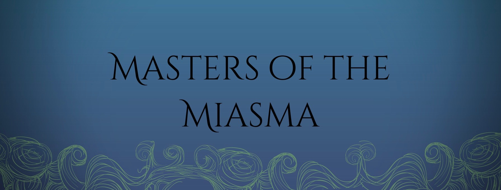

## a table-top RPG created by Michael "Marani" Orth

Masters of the Miasma, or MoTM for short, is a table-top RPG comparable to the well known Dungeons and Dragons.
This site **is not** an online version of the game, simply just a tool made to assist in starting and playing the game.

The main features of the app include a character sheet builder, a dice roller, a notes section, and a page that contains all links and information one would need to learn about and play the game.

A big thanks goes out to Marani for not only giving me the idea to build this app, but helping me find bugs and sort through the heaps of information on the wonderful game he's created.